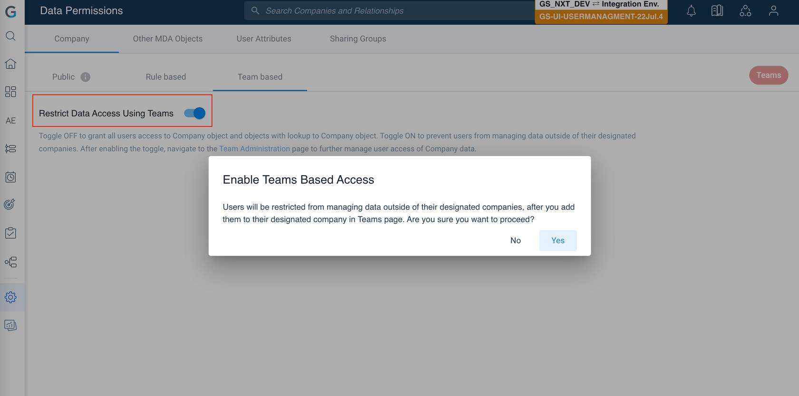

[Back to Read Me](https://github.com/Zennewman/Gainsight-Resources/blob/a0f7078e046e4e025608988aa1ae274447bf401f/README.md)

# Admin - User Management - NXT

Three steps to adding users
1. Loading users into Gainsight so they have access. This establishes basic user information such as User Name
2. Assign Permissions Permissions are assigned via two features, **Permission Bundles** and **Company Teams** 
3. Trigger welcome email send, which will prompt users to sign in and setup a password or SSO

### License Types
1. **Viewer** is a paid license that allows read only permissions of pages where access is granted to them. Typically used for executives and others not taking action within Gainsight. 
2. **Full** is a paid license that allows users read/write permissions to any products and information they are given access to by Permission Bundles. Typically used for CSMs, CSM Managers etc. 
3. **Internal Collaborator** is a free license that does not allow access to Gainsight, for users who will collaborate on activities in the timeline and need that collaboration documented in the record. Typically used for peripheral teams such as Sales.  
4. **External** is a free license and can't be assigned to any user by Administrators. A user with External license will be created when C/R360 or a Success Plan is shared with a Person/Contact record.
5. **Viewer + Analytics** is a paid license that provides users with additional exclusive access to Horizon Analytics, CX Center, Dashboards, Renewal Centre and Adoption Explorer.  Users can view insights across the entire customer base or segments instead of only specific customers. Typically assigned to executives and other consumers of data produced in Gainsight. 

### Adding Users

**Three ways to load users**
1. **Manually** Users can be created in Gainsight manually with some important details like First Name, Last Name, Username, Email ID and License Type. **Navigation** Administration -> User Management -> Add Users -> Add Users Manually. 
2. **CSV** Users can be loaded in bulk using a CSV file. **Navigation** Administration -> User Management -> Add Users -> Add Users From CSV. Admins can add any headers in the CSV file but the following headers are required for a user to be created:
	- CSV User Name
	- First Name 
	- Last Name 
	- Email
3. **External Systems** Users can be imported from External Systems such as Salesforce, Microsoft Dynamics 365, Slack, Zendesk and Hubspot using Connectors.  **Navigation** Administration -> User Management -> Add Users -> Add Users From External System. 

> **Attention**
> Only users with license type Full can be assigned Permission Bundles. Users with Viewer and Viewer+Analytics license are auto-assigned permission bundles by default. The process of assigning Permission Bundles is explained in the next lesson.

- During the user load from a CSV file, the CSV file should have the license types clearly written. The license type must be written with an underscore. For example, if the license type is Internal Collaborator, it must be written as **Internal_Collaborator** for the users to be loaded.
- During the user load from an external system, all active users from an external system will be loaded into Gainsight with an Internal Collaborator license.

### Permission Bundles

Permission Bundles are functionally the same thing as permission sets in Salesforce. They grant a collection of permissions that are defined inside the bundle. There are four types of permissions that can be defined inside a bundle: 
- **Navigation Permissions** allows users to view pages and sub pages 
- **Survey Permissions** Survey Permissions allow users to design, distribute, analyze, and administer surveys.
- **Email Template Permissions** Email Template Permissions allow users to design and administer the email templates.
- **Program Permissions** Program Permissions allow users to design, distribute, analyze and administer programs in [[Journey Orchestrator]].

**Assigning Licenses to Users** 

Bundles are assigned form the User Management page. 
1. Select the Users being granted permission
2. Click manage access and then manage licenses from the drop down. 
3. Select the desired license type from the dropdown in the menu that opens. 
4. Click save

**Deprovision Users**

From User Management, select the user to be deactivated and click the Make Users Inactive button.  

**Assigning Permission Bundles to Users**

Permission Bundles are assigned from the User Management page. Select the desired users, click the Manage Access button and select the Manage Permission Bundles option from the dropdown. 

)

### Company Teams

Company Teams determine which users can access a company's data. People assigned to a Company Team are the ones that are designated to be involved in working on an account. 

**Use Cases**

- When different users from across teams need to same level of access to work an account.
- When limited access to specific accounts is desired. 
- When new users start and you want to manually give them access to specified records. 

Team Based Permission can be used in tandem, or separately from Rules Based Permissions

**Enabling Permissions** 

>Team Based permissions for company data can be used separately, or combined with, Rules Based permissions. Both permission types must be toggled on from the Company tab on the Data Permissions page to be applicable in your org.
>
When either permission type is toggled on, users will only be able to access the company data assigned to them through either a rule or a team. All other company data will be inaccessible.

Users can be assigned to Companies from the Company page. Companies can also be assigned to Users from the User page. 
**Navigation** 

Administration -> Manage Teams -> Company or User page

**Data Ingestion Channels**

You can upload user data to the Teams feature using the following channels:
- Sync Teams data through Salesforce connector.
- Associations** section of this course.
- Upload data into the Company Teams standard object from a CSV file through Bulk APIs. For more information on this process, refer to [Load to Teams using Bulk APIs](https://support.gainsight.com/Gainsight_NXT/01Onboarding_and_Implementation/Onboarding_for_Gainsight_NXT/Login_and_Permissions/Teams#Load_data_to_Teams_using_Bulk_APIs) article section.

### User Authentication 

Three ways to authenticate: 
- Native database authentication enabled out of the box
- SSO via SAML
- SSO via Google 

**Note**
> SAML or GSuite Authentication is always given precedence over Database Authentication and at any point of time at least one type of authentication must always be enabled.

## Resources

- [Gainsight University Course](https://education.gainsight.com/admin-user-management-nxt)
- [User License Management](https://support.gainsight.com/Gainsight_NXT/01Onboarding_and_Implementation/Onboarding_for_Gainsight_NXT/Login_and_Permissions/User_License_Management#Comparison_of_Gainsight_License_Types)
	- [Comparison of Gainsight License Types](https://support.gainsight.com/Gainsight_NXT/01Onboarding_and_Implementation/Onboarding_for_Gainsight_NXT/Login_and_Permissions/User_License_Management#Comparison_of_Gainsight_License_Types)
- [Teams](https://support.gainsight.com/Gainsight_NXT/01Onboarding_and_Implementation/Onboarding_for_Gainsight_NXT/Login_and_Permissions/Teams#Search_a_user_and_assign_company(s))
	- [Assign Users to a Company ](https://support.gainsight.com/Gainsight_NXT/01Onboarding_and_Implementation/Onboarding_for_Gainsight_NXT/Login_and_Permissions/Teams#Search_a_company_and_assign_user(s))
	- [Assign Companies to Users](https://support.gainsight.com/Gainsight_NXT/01Onboarding_and_Implementation/Onboarding_for_Gainsight_NXT/Login_and_Permissions/Teams#Search_a_user_and_assign_company(s))
	- [Load Teams Using Bulk APIs](https://support.gainsight.com/Gainsight_NXT/01Onboarding_and_Implementation/Onboarding_for_Gainsight_NXT/Login_and_Permissions/Teams#Load_data_to_Teams_using_Bulk_APIs)
	- Salesforce Connector (to be added)
	- [Salesforce Connector Overview](https://support.gainsight.com/Gainsight_NXT/01Onboarding_and_Implementation/Onboarding_for_Gainsight_NXT_in_Salesforce/Salesforce_Connector/Salesforce_Connector_Overview)
- [Gainsight Authentication](https://support.gainsight.com/Gainsight_NXT/01Onboarding_and_Implementation/Onboarding_for_Gainsight_NXT/Login_and_Permissions/03Gainsight_Authentication#Setup_GSuite_Authentication)
	- [SAML Authentication](https://support.gainsight.com/Gainsight_NXT/01Onboarding_and_Implementation/Onboarding_for_Gainsight_NXT/Login_and_Permissions/03Gainsight_Authentication#Setup_SAML_Authentication)
	- [GSuite Authentication](https://support.gainsight.com/Gainsight_NXT/01Onboarding_and_Implementation/Onboarding_for_Gainsight_NXT/Login_and_Permissions/03Gainsight_Authentication#Setup_GSuite_Authentication)

